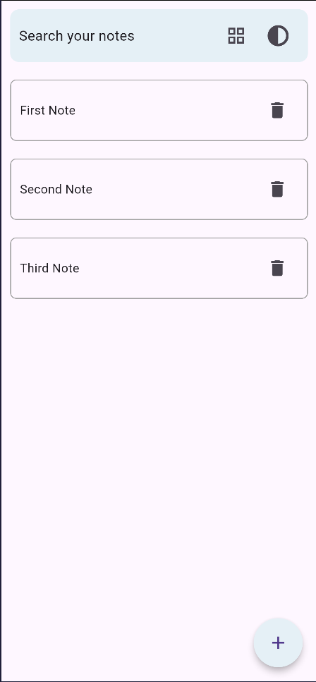
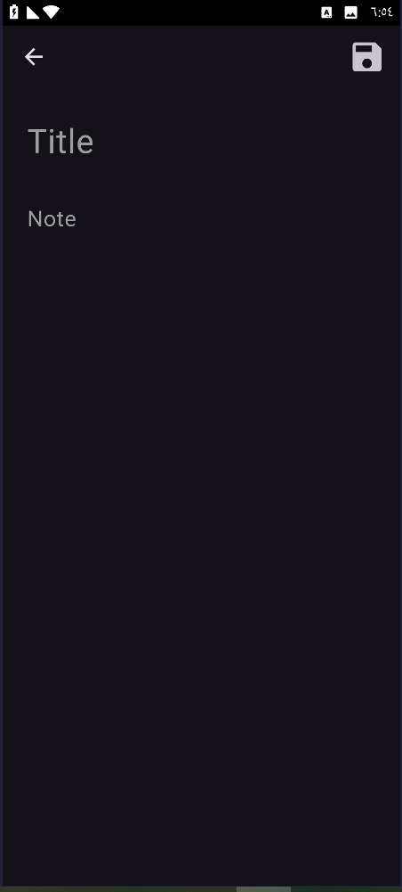

# 📝 To-Do List App

## 📌 Overview
A simple and efficient To-Do List app built with **Flutter**, designed for creating and managing notes with ease. It leverages **Hive** for fast and lightweight local storage, and **Provider** for effective state management. The app also includes light and dark theme support for a better user experience.

## ✨ Features
- ➕ Add new notes with a custom title.
- 📋 View all existing notes in a list or grid view.
- 🗑️ Delete notes with a single tap on the trash icon.
- 🔍 Search for specific notes easily.
- 🌗 Toggle between light and dark themes.

## 🛠️ Technologies Used
- **Flutter** – For building the UI and application logic.
- **Hive** – Lightweight and blazing fast NoSQL database for local storage.
- **Provider** – Efficient state management solution.

## 🚀 Getting Started

### Prerequisites
Make sure you have Flutter installed. Follow the official [Flutter installation guide](https://flutter.dev/docs/get-started/install).

### Installation Steps
1. Clone the repository:
   ```bash
   git clone https://github.com/your-username/todo-list-app.git
   ```
2. Navigate to the project directory:
   ```bash
   cd todo-list-app
   ```
3. Install the required packages:
   ```bash
   flutter pub get
   ```
4. Run the app:
   ```bash
   flutter run
   ```

## 📱 Usage
- Tap the **"+"** button to add a new note.
- Enter a title and save your note.
- View all notes on the home screen.
- Use the **search bar** to filter your notes.
- Tap the **trash icon** to delete a note.
- Access the **theme switch** from the app settings to toggle between light and dark modes.

## 📸 Screenshots

> *(Make sure the image paths and extensions are correct and consistent)*

- 
- 
- 
- 

## 🤝 Contributing
Contributions are welcome!  
If you'd like to contribute:
1. Fork the repository.
2. Create a new branch (`git checkout -b feature-name`).
3. Make your changes.
4. Submit a pull request.

Please follow the existing code style and include tests where appropriate.

## 📄 License
This project is licensed under the **MIT License**.  
See the [LICENSE](LICENSE) file for more details.

## 🙌 Acknowledgments
- Special thanks to the **Flutter community** for continuous support.
- The **Hive** and **Provider** teams for their powerful and easy-to-use packages.
